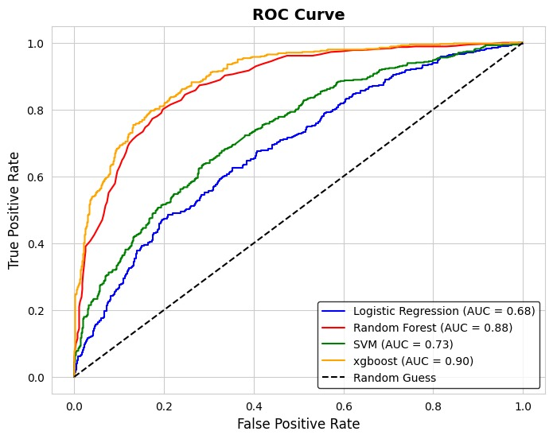
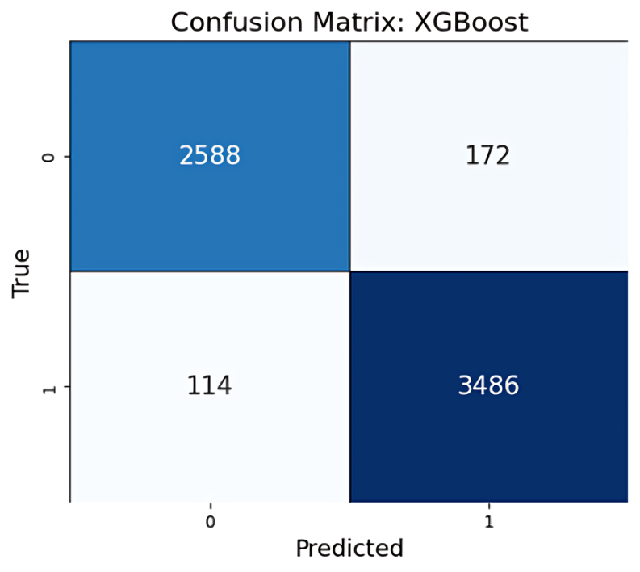

# Project : Classification of MDD vs Healthy controls 

## Here Were using Training Traditional ML algorithms to predict if a person is having MDD or if the individual is healthy

## Dataset
### This project uses TD-BRAIN dataset ,which is a collection of EEG recordings from individuals with different disorders and different age groups
-  TD-BRAIN dataset is available [here](https://www.brainclinics.com/resources/tdbrain-dataset)
- We have used mdd and healthy samples to train our model
- To download a small sample of the dataset for testing you can use the following command
```
git clone https://huggingface.co/ksaikrishna/ibrain_dataset
```

## Steps to install
### Step 1 To install node.js [click here ](https://nodejs.org/en/download) download and install it. [click here](https://www.youtube.com/watch?v=kQabFyl9r9I&t=431s) to watch a simple tutorial
### Step 2 Clone the repository
```
git clone https://github.com/ksai-krishna/final_year_project
```
### Step 3 Change your directory
```
cd final_year_project
```
### Step 4 install all required node modules 
```
node install
```
### Step 5 install all requirements (optional but you can also create venv and install in it)
```
pip install -r requirements.txt
```
### Step 6 Run this command To start the api server
```
uvicorn app:app --host 0.0.0.0 --port 5000
```
### Step 7 Then start the react app
```
node run dev
```

## Results and metrices

### Roc curve


### Confusion Matrix of XGB model 



## Acknowledgement
We would like to thank the TDBrain Dataset team for providing the comprehensive EEG dataset. Our special gratitude goes to Dr. Nagaraj Halemani Dr. Halemani for training us on understanding EEG data, guiding us through its preprocessing, and introducing us to the EEG domain as a whole, helping us learn how to effectively work with it.

## To understand the structure of the project please refer documentation.md